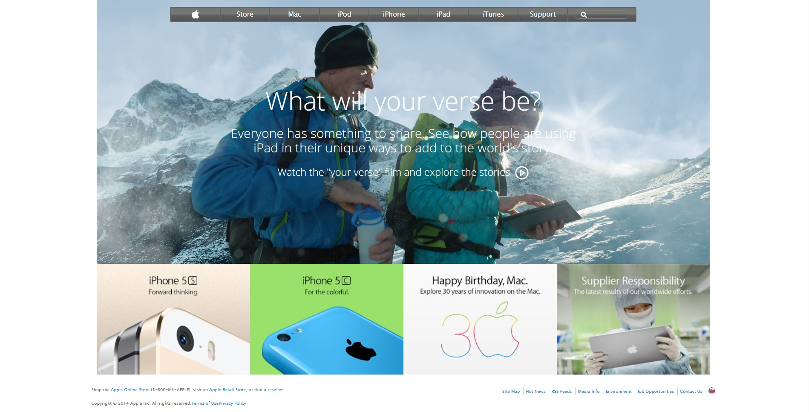

# AppleClone

Old Apple Website Clone project for Microverse program for practicing backgrounds and gradients. Project by Helcio Andre and Alan Solis

## Sample of Old Apple Website Clone with the following features:

- Navigation Bar with gradients
- Backgrounds features on all the project
- Flexbox

## Built With

- HTML
- CSS/SCSS
- SASS

## Live Demo

[Live Demo Link](https://rawcdn.githack.com/warblo001/AppleClone/2777b89eadd454cc42dcbc28503c5dafd006baec/index.html)

**See the page via the link above**

**See the Source Page via the link below**

[Source Page Link](https://web.archive.org/web/20140301004610/http://www.apple.com/)

## Authors

😎 **Helcio André**

- GitHub: [@helciodev](https://github.com/helciodev)
- Twitter: [@helcio_bruno](https://twitter.com/helcio_bruno)
- LinkedIn: [LinkedIn](https://www.linkedin.com/in/helcio-andre/)

👤 **Alan Solis**

- GitHub: [@github](https://github.com/warblo001)
- Twitter: [@twitter](https://twitter.com/Alan55572391)
- LinkedIn: [LinkedIn](https://www.linkedin.com/in/alan-solis-b567b044/)

## Show your support

Give a ⭐️ if you like this project!

## 📝 License

This project is [MIT](./license.txt) licensed.
